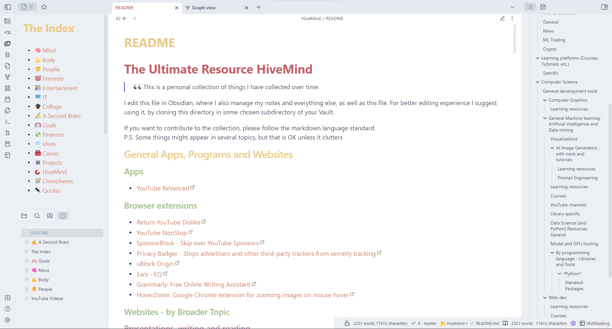

# The Ultimate Resource HiveMind
> This is a personal collection of things I have collected over time.

_If you want to contribute to the collection, please follow the markdown language standard._

I edit this file in [Obsidian](https://obsidian.md/), where I also manage my notes and everything else as well as this file. For better editing experience I suggest using it, by cloning this directory in some chosen subdirectory of your Vault.

The layout is in it's early stages so if you have a better idea on how to structure it please feel free to suggest on how to improve it 😇!

P.S. Some things might appear in several topics, but that is OK unless it clutters.

___

## General Apps, Programs and Websites

### Apps

- [YouTube ReVanced](https://github.com/revanced)

### Browser extensions

- [Return YouTube Dislike](https://chrome.google.com/webstore/detail/return-youtube-dislike/gebbhagfogifgggkldgodflihgfeippi)
- [YouTube NonStop](https://chrome.google.com/webstore/detail/youtube-nonstop/nlkaejimjacpillmajjnopmpbkbnocid)
- [SponsorBlock - Skip over YouTube Sponsors](https://sponsor.ajay.app/)
- [Privacy Badger - Stops advertisers and other third-party trackers from secretly tracking](https://privacybadger.org/)
- [uBlock Origin](https://chrome.google.com/webstore/detail/ublock-origin/cjpalhdlnbpafiamejdnhcphjbkeiagm?hl=sl)
- [Ears - EQ](https://chrome.google.com/webstore/detail/ears-bass-boost-eq-any-au/nfdfiepdkbnoanddpianalelglmfooik)
- [Grammarly: Free Online Writing Assistant](https://app.grammarly.com/)
- [HoverZoom: Google Chrome extension for zooming images on mouse hover](https://github.com/extesy/hoverzoom/)
- [ClearURLs: Automatically remove tracking elements from URLs.](https://github.com/ClearURLs/Addon)
- [DownThemAll!](https://www.downthemall.net/)

### Websites - by Broader Topic

#### Presentations, writing and reading

- [Tome - An AI powered slides/presentation creator](https://tome.app/invite/kristjan-krizman-clcf7qy26qk0r3a584wj26yhk) - Free credits, then Paid

#### Communications

- [Superhuman - AI powered email client for speeding up productivity](https://superhuman.com/) - Paid

#### General

- [Typing Practice](https://www.keybr.com/)
- [FirstRowSports](https://firstsrowsports.eu/)
- [Sflix](https://sflix.to/)
- [All Key Shop](https://www.allkeyshop.com/blog/)
- [HackerNews](https://news.ycombinator.com/)
- [Anand Tech](https://www.anandtech.com/)
- [Geizhals](https://geizhals.de/)
- [Spreadsheets - Grist](https://docs.getgrist.com/)
- [Resume Worded - Free instant feedback on your resume and LinkedIn profile](https://resumeworded.com/)

### Programs

#### General usecase

- [PowerToys: Windows system utilities to maximize productivity](https://github.com/microsoft/PowerToys)
- [DevToys: A Swiss Army knife for developers.](https://github.com/veler/DevToys)
- [KeePassXC - Local and Secure Password Manager](https://keepassxc.org/)
- [Pieces - Save your most used clipboards and organize it for later use](https://code.pieces.app/install)  - Free

#### Advanced (ex. Computer management)

- [terminal: The new Windows Terminal and the original Windows console host, all in the same place!](https://github.com/microsoft/terminal)
- [FanControl.Releases: This is the release repository for Fan Control, a highly customizable fan controlling software for Windows.](https://github.com/Rem0o/FanControl.Releases)

### Browsers

- [Waterfox](https://www.waterfox.net/)
- [Iridium Browser | A browser securing your privacy. That’s it.](https://iridiumbrowser.de/)
- [Vivaldi Browser | Now with built-in Translate, Mail, and Calendar](https://vivaldi.com/)
- [Secure, Fast & Private Web Browser with Adblocker | Brave Browser](https://brave.com/)
- [Libre Wolf](https://librewolf.net/)

### Movies

- [Zganjeflix](https://accounts.zganje.com/invite/NA7YoT26Lu8UU2yJRe8DQ6)

### Discord 

#### Bots

- [BitBot - Crypto bots that show current price](https://new.bitbot.tools/tickers)

---
## Productivity tools - Combined

- [Tome - An AI powered slides/presentation creator](https://tome.app/invite/kristjan-krizman-clcf7qy26qk0r3a584wj26yhk) - Free credits, then Paid
- [Superhuman - AI powered email client for speeding up productivity](https://superhuman.com/) - Paid
- [Pieces - Save your most used clipboards and organize it for later use](https://code.pieces.app/install)  - Free
- [Grammarly: Free Online Writing Assistant](https://app.grammarly.com/) - Free, Paid

---
## Finance Collection

### General

- [ETF portfolios made simple | justETF](https://www.justetf.com/en/)
- [Portfolio tracker](https://portfoliocharts.com/)
- [WallStreetZen](https://www.wallstreetzen.com/users/dashboard)
- [TradingLab - Trading Terminology](https://docs.tradinglab.ai/)
- [Tradervue Trading Journal - Journal, Analyze, and Share your trades](https://www.tradervue.com/)

### Finance - Slovenian Market

- [Razlike med s.p. in d.o.o.](https://mladipodjetnik.si/podjetniski-koticek/racunovodstvo/razlike-med-s-p-in-d-o-o)
- [Prispevki za enoosebni d.o.o. za poslovodne osebe](https://mladipodjetnik.si/novice-in-dogodki/novice/prispevki-za-enoosebni-d-o-o-za-poslovodne-osebe)
- [Prijava davka na delnice FURS](https://www.fu.gov.si/zivljenjski_dogodki_prebivalci/odsvojil_sem_vrednostne_papirje_druge_deleze_ali_investicijske_kupone/)
- [Prijava davka tutorial - YouTube](https://www.youtube.com/watch?v=CLcYRVMuZ7U&list=PLIhqsqxIQXCmnQDD11BxeOt8nQ_OKhnhI&index=13&t=11s)
- [Kriptovalute | Skrita Znanost | Crypto | Izola](https://www.skrita-znanost.com/)

### News

- [Yahoo Finance](https://finance.yahoo.com/)

### ML Trading

- [QuantConnect - For algorithmic trading strategies in a browser](https://www.quantconnect.com/)

### Crypto 

- [OpenSea, the largest NFT marketplace](https://opensea.io/)

___
## Learning platforms (Courses, Tutorials, etc.)

- [O'Reilly Media - Technology and Business Training](https://www.oreilly.com/)
- [LeetCode - The World's Leading Online Programming Learning Platform](https://leetcode.com/)
- [eNSA-splet](https://nsa-splet.si/index.php)

### Specific

- TBA
___

## Computer Science 

### General development tools

- [cheat.sh/:firstpage](https://cheat.sh/)
- [explainshell.com - match command-line arguments to their help text](https://explainshell.com)
- [OverAPI](https://overapi.com)
- [GitSheet](https://gitsheet.wtf)
- [Git Hint](https://git-hint.netlify.app/?ref=producthunt)
- [tldr pages](https://tldr.sh)
- [GitHub - nicolargo/glances: Glances an Eye on your system. A top/htop alternative for GNU/Linux, BSD, Mac OS and Windows operating systems.](https://github.com/nicolargo/glances)
- [GitHub - ogham/exa: A modern replacement for ‘ls’.](https://github.com/ogham/exa)
- [GitHub - jlevy/the-art-of-command-line: Master the command line, in one page](https://github.com/jlevy/the-art-of-command-line#windows-only)
- [Developer Roadmaps](https://roadmap.sh/)
- [DevToys: A Swiss Army knife for developers.](https://github.com/veler/DevToys)
- [GitHub Codespaces · GitHub](https://github.com/features/codespaces)
- [GitHub Copilot · Your AI pair programmer](https://copilot.github.com/)
- [Welcome To Colaboratory - Colaboratory](https://colab.research.google.com/)
- [https://libcinder.org/docs/index.html](https://libcinder.org/docs/index.html)
- [Workspace | Python & R Data Science IDEs in the cloud | DataCamp](https://www.datacamp.com/workspace)
- [Free-for.dev](https://free-for.dev/#/?id=free-fordev)
- [Pieces - Save your most used clipboards and organize it for later use](https://code.pieces.app/install)  - Free
- [Choose an open source license - Choose a License](https://choosealicense.com/)

### Computer Graphics

- [Shadertoy](https://www.shadertoy.com/)

#### Learning resources

- [The Cherno](https://www.youtube.com/c/TheChernoProject/videos)
- [Learn OpenGL, extensive tutorial resource for learning Modern OpenGL](https://learnopengl.com/)

### General Data Science, Machine learning, Artificial intelligence and Data mining

- [PerceptiLabs](https://docs.perceptilabs.com/perceptilabs/)
- [Kaggle](https://www.kaggle.com/#)
- [NVIDIA Isaac Sim | NVIDIA Developer](https://developer.nvidia.com/isaac-sim)
- [Hugging Face – The AI community building the future.](https://huggingface.co/)
- [Buildspace - Courses and Community Hub for building in public](https://buildspace.so/)
- [Design and trade algorithmic trading strategies in a web browser, with free financial data, cloud backtesting and capital - QuantConnect.com](https://www.quantconnect.com/)
- [Stability AI](https://stability.ai/?utm_source=buildspace.so&utm_medium=buildspace_project)

#### Visualizations

- [Data Viz Project | Collection of data visualizations to get inspired and finding the right type.](https://datavizproject.com/)

#### AI Image Generators - with tools and tutorials
- [Lexica Aperture](https://lexica.art/aperture)
- [Stable Diffusion 2-1 - a Hugging Face Space by stabilityai](https://huggingface.co/spaces/stabilityai/stable-diffusion)
	- [DreamStudio](http://beta.dreamstudio.ai/)
- [DreamBooth: Fine Tuning Text-to-Image Diffusion Models for Subject-Driven Generation](https://dreambooth.github.io/?utm_source=buildspace.so&utm_medium=buildspace_project)

##### Learning resources
- [AI Art Explained: How AI Generates Images (Stable Diffusion, Midjourney, and DALLE) - YouTube](https://youtu.be/MXmacOUJUaw)
	- [The Illustrated Stable Diffusion – Jay Alammar – Visualizing machine learning one concept at a time.](https://jalammar.github.io/illustrated-stable-diffusion/?utm_source=buildspace.so&utm_medium=buildspace_project)
- [What Are Word and Sentence Embeddings?](https://txt.cohere.ai/sentence-word-embeddings/)

##### Prompt Engineering
- [Prompt Engineering 101: Basics](https://buildspace.so/notes/prompt-engineering-101?utm_source=buildspace.so&utm_medium=buildspace_project)

#### Learning resources

- [StrataScratch](https://www.youtube.com/channel/UCW8Ews7tdKKkBT6GdtQaXvQ/videos)
- [MLU-Explain](https://mlu-explain.github.io/)
- [GitHub - microsoft/ML-For-Beginners: 12 weeks, 26 lessons, 52 quizzes, classic Machine Learning for all](https://github.com/microsoft/ML-For-Beginners)
- [GitHub - microsoft/AI-For-Beginners: 12 Weeks, 24 Lessons, AI for All!](https://github.com/microsoft/AI-For-Beginners)
- [Machine Learning by Stanford University | Coursera](https://www.coursera.org/learn/machine-learning)
- [Dive into Deep Learning — Dive into Deep Learning 0.17.5 documentation](https://d2l.ai/)
- [Pen and Paper Exercises in Machine Learning](https://arxiv.org/pdf/2206.13446.pdf)
- [Machine Learning with Python Certification](https://www.freecodecamp.org/learn/machine-learning-with-python/)
- [100DaysOfMLCode](https://media-exp1.licdn.com/dms/document/C4D1FAQHhn_ieyqzP2w/feedshare-document-pdf-analyzed/0/1657018373501?e=1657756800&v=beta&t=XINEfR-rKJNK0u-90PiBvhVUGyTsT0DbH_Gr7VsGL9g)
- [One machine learning question every day - bnomial](https://today.bnomial.com/)
- [Tech I'm Learning in 2023, Free Courses and Books - YouTube](https://www.youtube.com/watch?v=8sidnD2Wu2c)

#### Courses

- [Lesson 1: Practical Deep Learning for Coders 2022 - YouTube](https://www.youtube.com/watch?v=8SF_h3xF3cE&list=PLfYUBJiXbdtSvpQjSnJJ_PmDQB_VyT5iU&index=2)
- [Deep Reinforcement Learning Course](https://simoninithomas.github.io/deep-rl-course/)
- [GitHub - huggingface/diffusion-models-class: Materials for the Hugging Face Diffusion Models Course](https://github.com/huggingface/diffusion-models-class)

#### YouTube channels

- [Yannic Kilcher - YouTube](https://www.youtube.com/@YannicKilcher)
- [Nicholas Renotte](https://www.youtube.com/c/NicholasRenotte/videos)
- [codebasics - YouTube](https://www.youtube.com/channel/UCh9nVJoWXmFb7sLApWGcLPQ)
- [CodeEmporium](https://www.youtube.com/c/CodeEmporium/videos)
- [Part Time Larry - YouTube](https://www.youtube.com/@parttimelarry)
- [Jay Alammar - YouTube](https://www.youtube.com/@ai_io/featured)

#### Library specific

- [Deep Learning with PyTorch: A 60 Minute Blitz — PyTorch Tutorials 1.13.1+cu117 documentation](https://pytorch.org/tutorials/beginner/deep_learning_60min_blitz.html)

#### Data Science (and Python) Resources General

- [khuyentran1401/awesome-Python-data-science-books: Probably the best curated list of data science books in Python](https://github.com/khuyentran1401/awesome-Python-data-science-books)
- [khuyentran1401/Data-science: Collection of useful data science topics along with code and articles](https://github.com/khuyentran1401/Data-science)
- [khuyentran1401/Efficient_Python_tricks_and_tools_for_data_scientists: Efficient Python Tricks and Tools for Data Scientists](https://github.com/khuyentran1401/Efficient_Python_tricks_and_tools_for_data_scientists)
- [Data Science Simplified](https://www.youtube.com/channel/UCNMawpMow-lW5d2svGhOEbw/videos)
- [Efficient Python Tricks and Tools for Data Scientists](https://khuyentran1401.github.io/Efficient_Python_tricks_and_tools_for_data_scientists/README.html)
- [Data Science Tools](https://www.mit.edu/~amidi/teaching/data-science-tools/)
- [Interpretable Machine Learning](https://christophm.github.io/interpretable-ml-book/)
- [Machine learning articles - Bnomial](https://articles.bnomial.com/)
- [Hugging Face – The AI community building the future.](https://huggingface.co/)
- [microsoft/nni: An open source AutoML toolkit for automate machine learning lifecycle, including feature engineering, neural architecture search, model compression and hyper-parameter tuning.](https://github.com/microsoft/nni)

#### Model and GPU hosting

- [Banana - Machine Learning Model Deployment on Serverless GPUs](https://www.banana.dev/?utm_source=buildspace.so&utm_medium=buildspace_project)
- [Brev](https://brev.dev/?utm_source=buildspace.so&utm_medium=buildspace_project)
- [Railway](https://railway.app?referralCode=47fwx1)

#### By programming language - Libraries and Tools

##### *Python*

- [pipx](https://pypa.github.io/pipx/)
###### Standout Packages

- *Visualization*
	- [heartrate: Simple real time visualisation of the execution of a Python program.](https://github.com/alexmojaki/heartrate)
	- [rich: Rich is a Python library for rich text and beautiful formatting in the terminal.](https://github.com/Textualize/rich)

- *Debugging & Execution & Logging*
	- [loguru: Python logging made (stupidly) simple](https://github.com/Delgan/loguru)
	- [snoop: A powerful set of Python debugging tools, based on PySnooper](https://github.com/alexmojaki/snoop)

### Web-dev

#### Learning resources

#### Courses

- [React Tutorial: Learn React JS - Free 11-Hour Course](https://scrimba.com/learn/learnreact?utm_source=buildspace.so&utm_medium=buildspace_project)
- [Learn JavaScript for free - 7-hour interactive tutorial](https://scrimba.com/learn/learnjavascript?utm_source=buildspace.so&utm_medium=buildspace_project)

___

## Anime & Manga

### General

- [The Index](https://theindex.moe/)
- [Index | The Wiki](https://thewiki.moe/)
- [MALSync: Integrates MyAnimeList/AniList/Kitsu/Simkl into various sites, with auto episode tracking.](https://github.com/MALSync/MALSync)

### Apps

#### Mobile

- [tachiyomiJ2K: Free and open source manga reader for Android](https://github.com/Jays2Kings/tachiyomiJ2K)
- [aniyomi: Unofficial fork of Tachiyomi for anime](https://github.com/jmir1/aniyomi)

#### Desktop

- [miru: Bittorrent streaming software for anime torrents](https://github.com/ThaUnknown/miru)
- [Taiga](https://taiga.moe/)

### Torrents

- [Nyaa](https://nyaa.si/)
- [Shana Project](https://www.shanaproject.com/)
- [RARBG](https://rarbgway.org/torrents.php?search=&category%5B%5D=40)

___
## Awesome self hosted curated lists of resources

### Main - Origin

- [Awesome-Selfhosted | Curated list of awesome lists | Project-Awesome.org](https://project-awesome.org/awesome-selfhosted/awesome-selfhosted)
- [apd-core/core at master · awesomedata/apd-core · GitHub](https://github.com/awesomedata/apd-core/tree/master/core)

### Other topics

- [newTendermint/awesome-bigdata: A curated list of awesome big data frameworks, ressources and other awesomeness.](https://github.com/newTendermint/awesome-bigdata)
- [awesomedata/awesome-public-datasets: A topic-centric list of HQ open datasets.](https://github.com/awesomedata/awesome-public-datasets#earthscience)
- [hackerkid/Mind-Expanding-Books: Books everyone should read!](https://github.com/hackerkid/Mind-Expanding-Books)
- [EbookFoundation/free-programming-books: Freely available programming books](https://github.com/EbookFoundation/free-programming-books)
- [EbookFoundation/free-science-books: Inspired by free-programming-books, here's free-science-books](https://github.com/EbookFoundation/free-science-books)
- [ossu/computer-science: Path to a free self-taught education in Computer Science!](https://github.com/ossu/computer-science)
- [josephmisiti/awesome-machine-learning: A curated list of awesome Machine Learning frameworks, libraries and software.](https://github.com/josephmisiti/awesome-machine-learning)
- [vinta/awesome-python: A curated list of awesome Python frameworks, libraries, software and resources](https://github.com/vinta/awesome-python)
- [fffaraz/awesome-cpp: A curated list of awesome C++ (or C) frameworks, libraries, resources, and shiny things. Inspired by awesome-... stuff.](https://github.com/fffaraz/awesome-cpp)
- [papers-we-love/papers-we-love: Papers from the computer science community to read and discuss.](https://github.com/papers-we-love/papers-we-love)
- [ChristosChristofidis/awesome-deep-learning: A curated list of awesome Deep Learning tutorials, projects and communities.](https://github.com/ChristosChristofidis/awesome-deep-learning)
- [academic/awesome-datascience: An awesome Data Science repository to learn and apply for real world problems.](https://github.com/academic/awesome-datascience)
- [neutraltone/awesome-stock-resources: A collection of links for free stock photography, video and Illustration websites](https://github.com/neutraltone/awesome-stock-resources)
- [aviranzerioniac/awesome-piracy](https://github.com/aviranzerioniac/awesome-piracy)
- [khuyentran1401/awesome-Python-data-science-books: Probably the best curated list of data science books in Python](https://github.com/khuyentran1401/awesome-Python-data-science-books)
- [awesome-actions: A curated list of awesome actions to use on GitHub](https://github.com/sdras/awesome-actions)
- [facundoolano/software-papers: 📚 A curated list of papers for Software Engineers](https://github.com/facundoolano/software-papers)

___